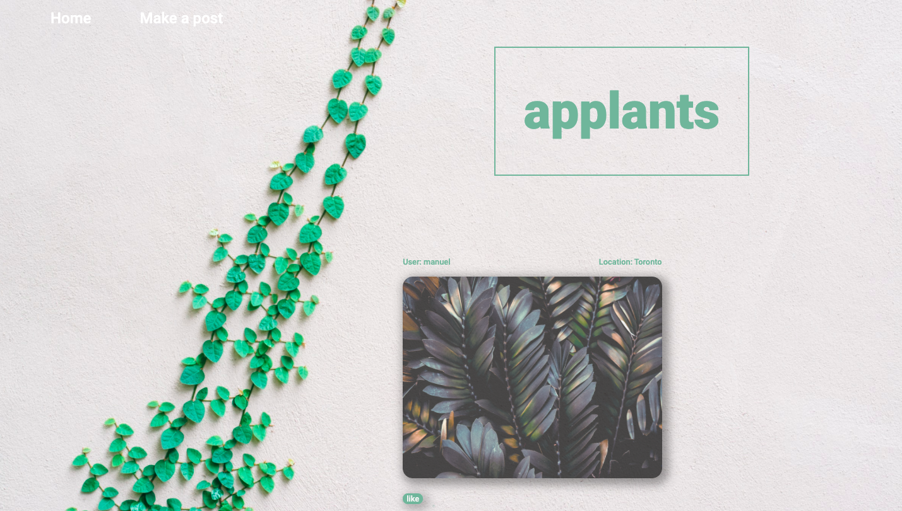
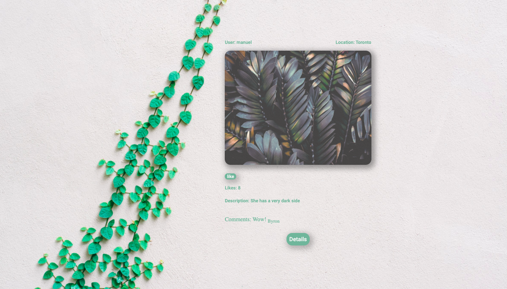
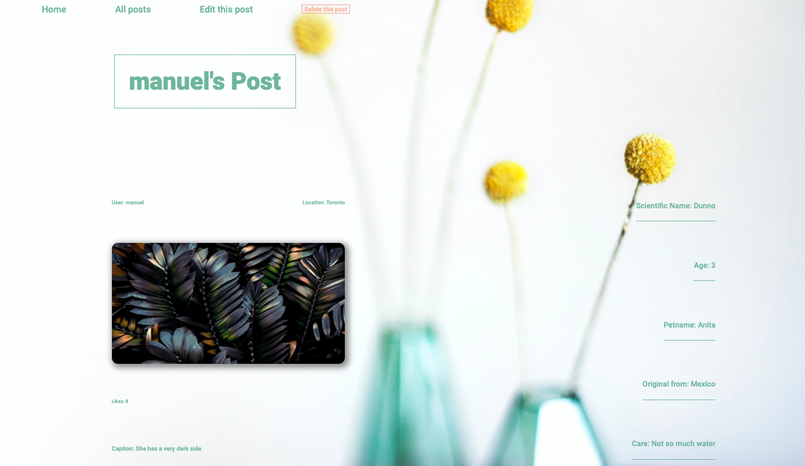
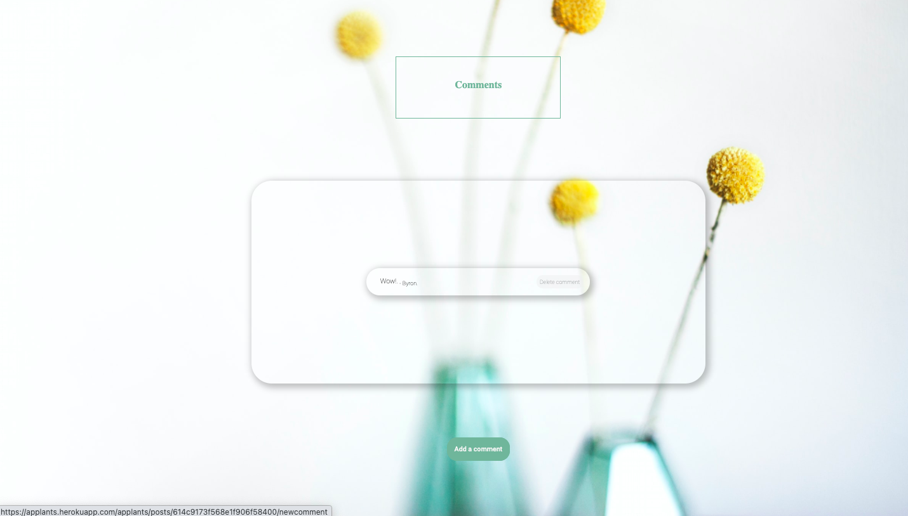
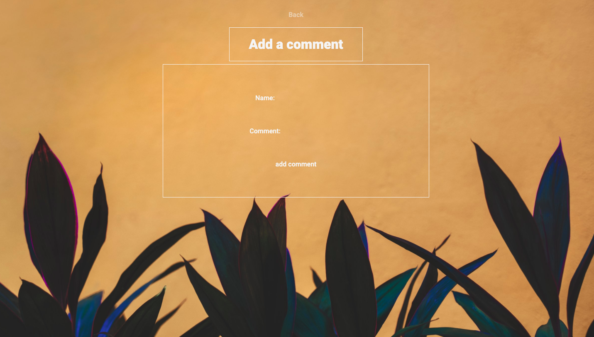
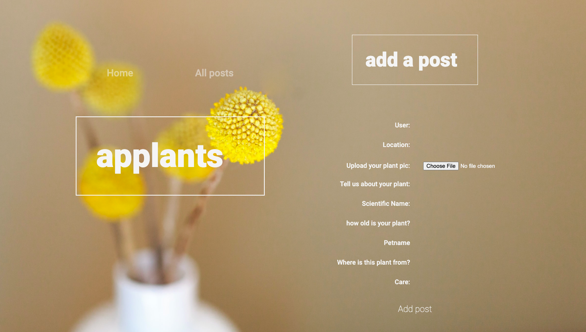

# Project Two: Node-Express-MongoDB Full-stack CRUD Application

## PHASE ONE : Content ;

1. Name of the app.
2. Project Wireframe.
3. User stories
4. ERD

---

---

### 1. Name Of The Game :

applants.

---

### 2. Project Wireframe :

click [here](https://app.moqups.com/8beBsfm4Co/edit/page/a6e4bd6ae) to view my wireframe.

---

### 3. User Stories :

1. As an user I want to see the main a welcome page to the app with a button I can click on that will take me to see all the posts.

2. As an user I want to see a page with all the posts. This page must contain a navigation bar with a link that will take me back to the welcome page, another link that will take me to a new page where I can create a new post. As an user, I want to be able to see a list of all the post with the most relevant information. There should be a link for the user that will allow me to see all posts by that user. Another link I can click on that will take me to a different page where a single post will be displayed showing more details.

3. As an user I want to be able to create a post by submiting a form and see it in the all posts page after submition.

4. As an user, while in the post details page, I want to be able to edit the post itself, delelete the post, view comments for the post itself, be able to delete comments for the post and be able to click on a link that will take me to a page where I can submit a comment.

5. As an user, I want to be able to add a comment by submitting a form and then be able to see it in the post's details page.

---

### 4. ERD :

For this project I used the following schemas and connections in between:

1.  Post schema:

        const postSchema = new mongoose.Schema(
        {
        user: [User.userSchema],
        location: {
        required: true,
        type: String,

        default: "Planet earth",
        },
        img: {

        required: true,
        type: String,
        default: "placeholder.jpg",
        },
        likes: {
        type: Number,

        default: 0,
        },
        caption: {
        required: true,
         type: String,
        },
        details: {
        scientificName: { type: String },
        age: { type: Number, min: 0, default: 0 },
        petname: { type: String, default: "Beauriful Plant" },
        originalFrom: { type: String, default: "Planet earth" },
        care: {
        type: String,
        default: "Lots of love and fair amount of water and natural light",
        },
        },
        comments: [{ type: Schema.Types.ObjectId, ref: "Comment" }],
        },
        { timestamps: true }
        );

2.  User schema:

        const userSchema = new mongoose.Schema(
        {
          user: { type: String, required: true },
         },
        { timestamps: true }
        );

3.  Comment schema:

         const commentSchema = new mongoose.Schema(
         {
         name: { type: String, required: true },
        comment: { type: String, required: true },
        },
        { timestamps: true }
        );

---

---

## PHASE TWO : Content ;

1. Title Of The App & Quick Intro.
2. App Screenshots.
3. Technologies Used.
4. Getting Started.
5. Next Steps

---

---

### 1. Title Of The Game :

applants.

---

### 1. Quik Intro :

applants is a basic social web app inspired on Instagram.
It functions as social media app where one can create, read, update and delete posts that consist of several pieces of information.

---

### 2. App Screenshots :

1. Welcome page.

2. All posts page 1

3. All posts page 2

4. One post page 1

5. One post page 2

6. Add comment page

6. Edit post page

7. Make a post page
   

---

### 3. Technologies Used :

1. HTML
2. CSS
3. JavaScript
4. MongoDB
5. Mongoose
6. NodeJS
7. Chrome dev tools
8. Express

---

### 4. Getting Started :

Click [here](https://applants.herokuapp.com) to checkout the app.

---

### 5. Next Steps :

Futher imrpovements to the brower-based app:

1. Improve schema design
2. Improve routes
3. Apply authentication
4. Make it responsive
